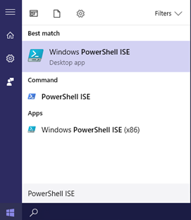
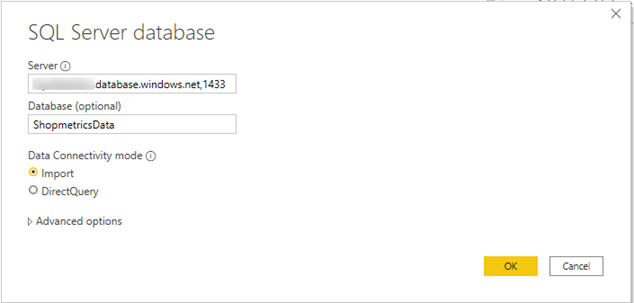
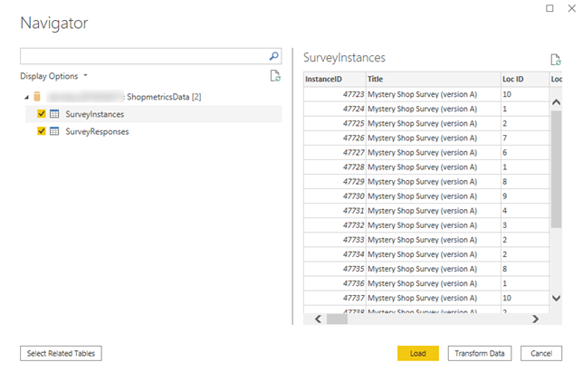
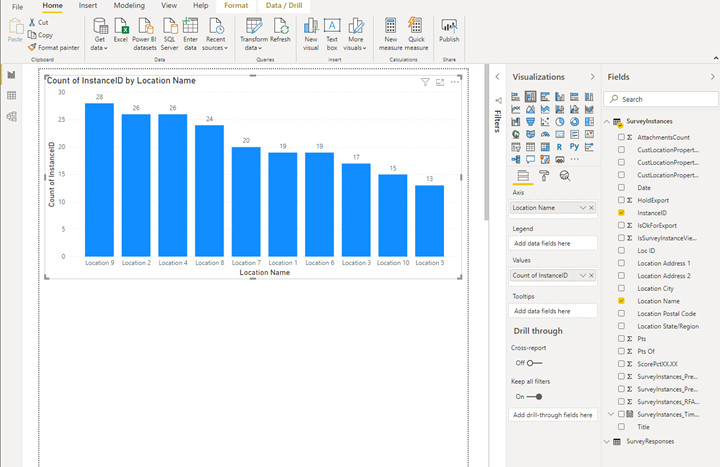

# Shopmetrics Integration with Power BI via an ETL Process

Last Modified: 2023-02-10 | Code: SIPB

This document explains how to use the Shopmetrics Command and Query APIs to extract, load and mark as extracted surveys and survey data approved for end-client review.

The example will demonstrate:

- Extracting data from Query API Client Analytics Resource
- Loading the data in a SQL Server database using a Connection String
- Marking the surveys as extracted using the Command API
- Loading the data into Power BI Desktop using SQL Server database as a Data Source

## Prerequisites

The examples below use the following technologies:

- **Microsoft SQL Server Express** for DBMS (Database Management System) to load the data locally (on-premises);
  - Note that the same method (and code) can be used to load the data in an Azure SQL Server Database by only changing the Connection String
- **PowerShell** for running the scripts that will perform the Extract, Transform and Load operations.
- **Postman** for demo purposes only
- **Management Studio** for connecting to the designated SQL Server database

Note that instead of Microsoft SQL Server and PowerShell you can also use Shopmetrics Command and Query APIs with technologies of your choice (like Python, C#, PHP, Ruby and others).

Windows PowerShell comes installed by default in every Windows, starting with Windows 7. To use it, just type “PowerShell ISE” in the search field of the start menu:



 More information about PowerShell, you can find here:<https://docs.microsoft.com/en-us/powershell>

More information about Management Studio, you can find here: <https://docs.microsoft.com/en-us/sql/ssms/download-sql-server-management-studio-ssms>

## Shopmetrics Platform Setup:

The example also requires the following setup to be made in your Shopmetrics Platform:

- User Account with the proper Client Access and associated Client Credentials. For more information, please refer to the “API Authorization” article.
- 2 Query Alias for the Client Analytics Query API with Object Names SurveyExplorerNewSurveys and SurveyInstancesNewQuestionsRaw. You can use different Object Names for the aliases but make sure this is reflected in the code. For more information, please refer to the “Client Analytics Query Resource” and “Query Aliases” articles.

The Query Specifications for the required Query Aliases are:

**SurveyExplorerNewSurveys:** [Title][Loc ID][Location Address 1][Location Address 2][Location Name][Location State/Region][Location Postal Code][Date][ScorePctXX.XX][Pts][Pts Of][CustLocationProperty001][CustLocationProperty002][CustLocationProperty003][AttachmentsCount][SurveyInstances\_ClientAccessStatusID][InstanceID][SurveyInstances\_PrecalcRFAsOpen][SurveyInstances\_PrecalcRFAsClosed][WorkflowStepID][IsBeingExported][IsExportCompletedButFailed][IsOkForExport][HoldExport][IsExportCompleted][IsSurveyInstanceViewedBySecurityUser][IsSectionLevel1WeightDefinedPrecalc][Location City][SurveyInstances\_RFAStatusID][ClientAuditMode][Location Photo URL][Login][Shopper Name][WHERE:IsSurveyInstanceViewedBySecurityUser|0][ORDERBY:Date|DESC]

**SurveyInstancesNewQuestionsRaw:** [InstanceID][ProtoSurveyID][ProtoQuestionID][Question Text][Answer Positions][Pts][Pts Of]

## Example: Extract Data from the Shopmetrics Query API and Load it to your Local or Cloud DB

The code example will demonstrate downloading data from two Query Specification Aliases: SurveyExplorerNewSurveys and SurveyInstancesNewQuestionsRaw using the Client Analytics Query Resource and loading it two tables in the designated database: [dbo].[SurveyInstances] and [dbo].[SurveyResponses]. Both aliases extract data for surveys with Opened Status 0 for the user that will be used to call the API.

After the data is loaded, the code will call the command query (dataset: /Apps/SM/SurveyManager/SurveyInstancesOpenedStatusSet to mark the loaded survey instances with Opened Status 1). This will ensure that when the Query API is called again, only new surveys will be downloaded.

**SQL Server Database Setup**

We recommend first connecting to the designated database using the latest version of Management Studio. This will validate that your connection is working and you have the proper access. Using Management Studio, you will be able to run different SQL commands required for the setup, but also to later verify that you have the correct data in the expected format.

The PowerShell code uses the following tables to load the data in: [dbo].[SurveyInstances] and [dbo].[SurveyResponses]. Select the database and execute the following code to create the required tables:

```
--DROP TABLE [dbo].[SurveyInstances]

IF OBJECT_ID('[dbo].[SurveyInstances]') IS NULL
BEGIN
    CREATE TABLE [dbo].[SurveyInstances]
    (
        [InstanceID] BIGINT NOT NULL
        ,[Title] NVARCHAR(500)
        ,[Loc ID] NVARCHAR(50)
        ,[Location Name] NVARCHAR(50)
        ,[Location City] NVARCHAR(50)
        ,[Location State/Region] NVARCHAR(8)
        ,[Location Postal Code] NVARCHAR(12)
        ,[Location Address 1] NVARCHAR(150)
        ,[Location Address 2] NVARCHAR(150)
        ,[Date] VARCHAR(10)
        ,[ScorePctXX.XX] DECIMAL(18,2)
        ,[Pts] BIGINT
        ,[Pts Of] BIGINT
        ,[CustLocationProperty001] NVARCHAR(100)
        ,[CustLocationProperty002] NVARCHAR(100)
        ,[CustLocationProperty003] NVARCHAR(100)
        ,[AttachmentsCount] INT
        ,[SurveyInstances_RFAStatusID] TINYINT
        ,[SurveyInstances_PrecalcRFAsOpen] TINYINT
        ,[SurveyInstances_PrecalcRFAsClosed] TINYINT
        ,[IsOkForExport] TINYINT
        ,[HoldExport] TINYINT
        ,[IsSurveyInstanceViewedBySecurityUser] INT
        ,[SurveyInstances_TimeStampLastValidated] SMALLDATETIME
    );

    ALTER TABLE [dbo].[SurveyInstances]
    ADD CONSTRAINT [PK_SurveyInstances] PRIMARY KEY ([InstanceID]); 

END;

GO

--DROP TABLE [dbo].[SurveyResponses]

IF OBJECT_ID('[dbo].[SurveyResponses]') IS NULL
BEGIN
    CREATE TABLE [dbo].[SurveyResponses]
    (
        [InstanceID] [bigint] NOT NULL
        , [ProtoSurveyID] [int] NULL
        , [ProtoQuestionID] [int] NOT NULL
        , [Question Text] [nvarchar](max) NULL
        , [Answer Positions] [nvarchar](max) NULL
        , [Pts] [bigint] NULL
        , [Pts Of] [bigint] NULL
    );

    ALTER TABLE [dbo].[SurveyResponses]
    ADD CONSTRAINT [PK_SurveyResponses] PRIMARY KEY ([InstanceID],[ProtoQuestionID]); 

END;

GO
```

**PowerShell Code:**

```
Clear-Host;
Write-Host "Script Started";
Write-Host;

#Url to the Shopmetrics Platform:
$SMPlatformURL = "https://training52.shopmetrics.com";

#Endpoint to get authentication token (Access Token):
$GetTokenEndpoint = "$($SMPlatformURL)/oauth/connect/token";

#Object with credentials to be used as payload for "get access token":
$GetTokenRequestPayload = @{client_id="Training52_DemoCompanyApi"; client_secret="client_secret"; grant_type="client_credentials"};

#Request Object to be used by the REST Request:
$GetTokenRequestObject = @{
    Uri         = $GetTokenEndpoint;
    Method      = "POST";
    Body        = $GetTokenRequestPayload;
};

#REST Request to get the Access Token and assigned to a variable:
$GetTokenResponse= Invoke-RestMethod @GetTokenRequestObject;
$AccessToken = $GetTokenResponse."access_token";
#Print Access Token to check if it is successfully retrieved:
#Write-Host $AccessToken;

#Endpoint to execute the dataset:
$DatasetsExecuteEndpoint = "$($SMPlatformURL)/api/v2/execute";

#SQL Server Database Credentials:
$DBServerName = "SQLSERVER\INST1";
$DBName = "ShopmetricsData";
$DBUser = "SMIntegration";
$DBUserPassword = "637pxB38AFz1";
$DBConnectionString = "Data Source=$($DBServerName); Initial Catalog=$($DBName); User Id=$($DBUser); Password=$($DBUserPassword)";

#SQL Server Database Connection Test:
Try {
    $ObjConnection = New-Object System.Data.SqlClient.SqlConnection $DBConnectionString;
    $ObjConnection.Open();
    $ObjConnection.Close();
    #Write-Host $True;
}
Catch {
    Write-Host "Connection to $($DBName) failed with the following message:" -Foregroundcolor Red;
    Write-Host "$($_.Exception.Message)" -Foregroundcolor Red;
    Write-Host "Script terminated." -Foregroundcolor Red;
    Write-Host "";
    Exit;
};

#The value of the "post" parameter of the Execute Dataset request. This is a JSON string where all required parameters of the dataset must be provided:
#When we use Data Model definition we can use only QuerySpecification paramater.
$DatasetExecutePostParam = '{ "action": "exec", "dataset": { "datasetname": "/Apps/SM/APIv2/Query/ClientAnalytics/ClientAnalytics" }, "parameters": [{ "name": "QuerySpecification", "value": "SurveyExplorerNewSurveys" }, { "name": "ClientOrFormIDs", "value": "-1135" }] }';

#The Body of the Request Object to be used by the Execute Dataset request. It has only 1 parameter: "post" and its "value" is the "JSON string" with the input parameters:
$DatasetExecuteRequestPayload = @{post="$DatasetExecutePostParam"};

#Request Object to be used by the Execute Dataset request:
$DatasetExecuteRequestObject = @{
    Uri         = $DatasetsExecuteEndpoint;
    Headers     = @{"Authorization" = "Bearer $AccessToken"};
    Method      = "POST";
    Body        = $DatasetExecuteRequestPayload;
};

#REST Request to get the output data and assigned to a variable:
$SurveyExplorerNewSurveysResponse = (Invoke-RestMethod @DatasetExecuteRequestObject);

#Write the output data (in JSON format) in a txt file:
$SurveyExplorerNewSurveysResponse | ConvertTo-Json -Depth 20 | Out-String | Out-File -FilePath "$($PSScriptRoot)\IntegratingWithShopmetrics_ETL_Basic1.txt";

#An array that will hold the IDs of all successfully loaded survey instances:
$LoadedSurveys = @();

#Assigning the data section of the response to a local variable:
$SurveyExplorerNewSurveys = $SurveyExplorerNewSurveysResponse."dataset"."data"[0];

#Write-Host "Length = $($SurveyExplorerNewSurveysResponse."dataset"."data"[0].Length)";
#Write-Host "Date = $($SurveyExplorerNewSurveysResponse."dataset"."data"[0][0]."Survey Date".GetType())";

$SurveyExplorerInsertTemplate = "
INSERT INTO [dbo].[SurveyInstances](
    [InstanceID],
    [Title],
    [Loc ID],
    [Location Name],
    [Location City],
    [Location State/Region],
    [Location Postal Code],
    [Location Address 1],
    [Location Address 2],
    [Date],
    [ScorePctXX.XX],
    [Pts],
    [Pts Of],
    [CustLocationProperty001],
    [CustLocationProperty002],
    [CustLocationProperty003],
    [AttachmentsCount],
    [SurveyInstances_RFAStatusID],
    [SurveyInstances_PrecalcRFAsOpen],
    [SurveyInstances_PrecalcRFAsClosed],
    [IsOkForExport],
    [HoldExport],
    [IsSurveyInstanceViewedBySecurityUser],
    [SurveyInstances_TimeStampLastValidated]
) 
VALUES (@InstanceID,
        @Title,
        @LocID,
        @LocationName,
        @LocationCity,
        @LocationStateRegion,
        @LocationPostalCode,
        @LocationAddress1,
        @LocationAddress2,
        @Date,
        @ScorePctXXXX,
        @Pts,
        @PtsOf,
        @CustLocationProperty001,
        @CustLocationProperty002,
        @CustLocationProperty003,
        @AttachmentsCount,
        @SurveyInstances_RFAStatusID,
        @SurveyInstances_PrecalcRFAsOpen,
        @SurveyInstances_PrecalcRFAsClosed,
        @IsOkForExport,
        @HoldExport,
        @IsSurveyInstanceViewedBySecurityUser,
        @SurveyInstances_TimeStampLastValidated
    )
;";

#Write-Host $SurveyExplorerInsertTemplate; Exit;

$objConnection = New-Object System.Data.SqlClient.SqlConnection;
$objConnection.ConnectionString = $DBConnectionString;
$objConnection.Open();

$SqlCmd = New-Object System.Data.SqlClient.SqlCommand;
$SqlCmd.Connection = $objConnection;
$SqlCmd.CommandTimeout = 60;
$SqlCmd.CommandType=[System.Data.CommandType]"Text";
$SqlCmd.CommandText=$SurveyExplorerInsertTemplate;

$SqlCmd.Parameters.Add("@InstanceID",[system.data.SqlDbType]::BigInt) | Out-Null;
$SqlCmd.Parameters.Add("@Title",[system.data.SqlDbType]::Nvarchar) | Out-Null;
$SqlCmd.Parameters.Add("@LocID",[system.data.SqlDbType]::Nvarchar) | Out-Null;
$SqlCmd.Parameters.Add("@LocationName",[system.data.SqlDbType]::Nvarchar) | Out-Null;
$SqlCmd.Parameters.Add("@LocationCity",[system.data.SqlDbType]::Nvarchar) | Out-Null;
$SqlCmd.Parameters.Add("@LocationStateRegion",[system.data.SqlDbType]::Nvarchar) | Out-Null;
$SqlCmd.Parameters.Add("@LocationPostalCode",[system.data.SqlDbType]::Nvarchar) | Out-Null;
$SqlCmd.Parameters.Add("@LocationAddress1",[system.data.SqlDbType]::Nvarchar) | Out-Null;
$SqlCmd.Parameters.Add("@LocationAddress2",[system.data.SqlDbType]::Nvarchar) | Out-Null;
$SqlCmd.Parameters.Add("@Date",[system.data.SqlDbType]::Nvarchar) | Out-Null;
$SqlCmd.Parameters.Add("@ScorePctXXXX",[system.data.SqlDbType]::Decimal) | Out-Null;
$SqlCmd.Parameters.Add("@Pts",[system.data.SqlDbType]::BigInt) | Out-Null;
$SqlCmd.Parameters.Add("@PtsOf",[system.data.SqlDbType]::BigInt) | Out-Null;
$SqlCmd.Parameters.Add("@CustLocationProperty001",[system.data.SqlDbType]::Nvarchar) | Out-Null;
$SqlCmd.Parameters.Add("@CustLocationProperty002",[system.data.SqlDbType]::Nvarchar) | Out-Null;
$SqlCmd.Parameters.Add("@CustLocationProperty003",[system.data.SqlDbType]::Nvarchar) | Out-Null;
$SqlCmd.Parameters.Add("@AttachmentsCount",[system.data.SqlDbType]::Int) | Out-Null;
$SqlCmd.Parameters.Add("@SurveyInstances_RFAStatusID",[system.data.SqlDbType]::TinyInt) | Out-Null;
$SqlCmd.Parameters.Add("@SurveyInstances_PrecalcRFAsOpen",[system.data.SqlDbType]::TinyInt) | Out-Null;
$SqlCmd.Parameters.Add("@SurveyInstances_PrecalcRFAsClosed",[system.data.SqlDbType]::TinyInt) | Out-Null;
$SqlCmd.Parameters.Add("@IsOkForExport",[system.data.SqlDbType]::TinyInt) | Out-Null;
$SqlCmd.Parameters.Add("@HoldExport",[system.data.SqlDbType]::TinyInt) | Out-Null;
$SqlCmd.Parameters.Add("@IsSurveyInstanceViewedBySecurityUser",[system.data.SqlDbType]::Int) | Out-Null;
$SqlCmd.Parameters.Add("@SurveyInstances_TimeStampLastValidated",[system.data.SqlDbType]::DateTime) | Out-Null;

ForEach($Row in $SurveyExplorerNewSurveys) {
    $SqlCmd.Parameters["@InstanceID"].Value = $Row."InstanceID";
    $SqlCmd.Parameters["@Title"].Value = $(If($Row."Title") {$Row."Title"} Else {[System.DBNull]::Value});
    $SqlCmd.Parameters["@LocID"].Value = $(If($Row."Loc ID") {$Row."Loc ID"} Else {[System.DBNull]::Value});
    $SqlCmd.Parameters["@LocationName"].Value = $(If($Row."Location Name") {$Row."Location Name"} Else {[System.DBNull]::Value});
    $SqlCmd.Parameters["@LocationCity"].Value = $(If($Row."Location City") {$Row."Location City"} Else {[System.DBNull]::Value});
    $SqlCmd.Parameters["@LocationStateRegion"].Value = $(If($Row."Location State/Region") {$Row."Location State/Region"} Else {[System.DBNull]::Value});
    $SqlCmd.Parameters["@LocationPostalCode"].Value = $(If($Row."Location Postal Code") {$Row."Location Postal Code"} Else {[System.DBNull]::Value});
    $SqlCmd.Parameters["@LocationAddress1"].Value = $(If($Row."Location Address 1") {$Row."Location Address 1"} Else {[System.DBNull]::Value});
    $SqlCmd.Parameters["@LocationAddress2"].Value = $(If($Row."Location Address 2") {$Row."Location Address 2"} Else {[System.DBNull]::Value});
    $SqlCmd.Parameters["@Date"].Value = $(If($Row."Date") {$Row."Date"} Else {[System.DBNull]::Value});
    $SqlCmd.Parameters["@ScorePctXXXX"].Value = $(If($Row."ScorePctXX.XX") {$Row."ScorePctXX.XX"} Else {[System.DBNull]::Value});
    $SqlCmd.Parameters["@Pts"].Value = $(If($Row."Pts") {$Row."Pts"} Else {[System.DBNull]::Value});
    $SqlCmd.Parameters["@PtsOf"].Value = $(If($Row."Pts Of") {$Row."Pts Of"} Else {[System.DBNull]::Value});
    $SqlCmd.Parameters["@CustLocationProperty001"].Value = $(If($Row."CustLocationProperty001") {$Row."CustLocationProperty001"} Else {[System.DBNull]::Value});
    $SqlCmd.Parameters["@CustLocationProperty002"].Value = $(If($Row."CustLocationProperty002") {$Row."CustLocationProperty002"} Else {[System.DBNull]::Value});
    $SqlCmd.Parameters["@CustLocationProperty003"].Value = $(If($Row."CustLocationProperty003") {$Row."CustLocationProperty003"} Else {[System.DBNull]::Value});
    $SqlCmd.Parameters["@AttachmentsCount"].Value = $(If($Row."AttachmentsCount") {$Row."AttachmentsCount"} Else {[System.DBNull]::Value});
    $SqlCmd.Parameters["@SurveyInstances_RFAStatusID"].Value = $(If($Row."SurveyInstances_RFAStatusID") {$Row."SurveyInstances_RFAStatusID"} Else {[System.DBNull]::Value});
    $SqlCmd.Parameters["@SurveyInstances_PrecalcRFAsOpen"].Value = $(If($Row."SurveyInstances_PrecalcRFAsOpen") {$Row."SurveyInstances_PrecalcRFAsOpen"} Else {[System.DBNull]::Value});
    $SqlCmd.Parameters["@SurveyInstances_PrecalcRFAsClosed"].Value = $(If($Row."SurveyInstances_PrecalcRFAsClosed") {$Row."SurveyInstances_PrecalcRFAsClosed"} Else {[System.DBNull]::Value});
    $SqlCmd.Parameters["@IsOkForExport"].Value = $(If($Row."IsOkForExport") {$Row."IsOkForExport"} Else {[System.DBNull]::Value});
    $SqlCmd.Parameters["@HoldExport"].Value = $(If($Row."HoldExport") {$Row."HoldExport"} Else {[System.DBNull]::Value});
    $SqlCmd.Parameters["@IsSurveyInstanceViewedBySecurityUser"].Value = $(If($Row."IsSurveyInstanceViewedBySecurityUser") {$Row."IsSurveyInstanceViewedBySecurityUser"} Else {[System.DBNull]::Value});
    $SqlCmd.Parameters["@SurveyInstances_TimeStampLastValidated"].Value = $(If($Row."SurveyInstances_TimeStampLastValidated") {$Row."SurveyInstances_TimeStampLastValidated"} Else {[System.DBNull]::Value});

    #Write-Host " InstanceID = $($Row."InstanceID")" -Foregroundcolor Red;
    #Trying to load the Survey Instance in the Database
    Try {
        $SqlCmd.ExecuteNonQuery()| Out-Null;
    }
    Catch {
        #If the load fails, the code continues to the next Survey Instance
        Write-Host "Saving InstanceID $($Row."InstanceID") failed with the following message:" -Foregroundcolor Red;
        Write-Host "$($_.Exception.Message)" -Foregroundcolor Red;
        Continue;
    };

    #The code below this line will be executed only if Survey Instances is successfully loaded in the Database:
    #Adding the Survey Instance ID to the Collection of successfully loaded Surveys Instances:

    $LoadedSurveys += $Row."InstanceID";
};

$objConnection.Close();
$objConnection = $null;

Write-Host "The data from the 'SurveyExplorerNewSurveys' model was successfully loaded to the [dbo].[SurveyInstances] table in the database";

#The value of the "post" parameter of the Execute Dataset request. This is a JSON string where all required parameters of the dataset must be provided:
#When we use Data Model definition we can use only QuerySpecification paramater.
$DatasetExecutePostParam = '{ "action": "exec", "dataset": { "datasetname": "/Apps/SM/APIv2/Query/ClientAnalytics/ClientAnalytics" }, "parameters": [{ "name": "QuerySpecification", "value": "SurveyInstancesNewQuestionsRaw" }, { "name": "ClientOrFormIDs", "value": "-1135" }] }';

#The Body of the Request Object to be used by the Execute Dataset request. It has only 1 parameter: "post" and its "value" is the "JSON string" with the input parameters:
$DatasetExecuteRequestPayload = @{post="$DatasetExecutePostParam"};

#Request Object to be used by the Execute Dataset request:
$DatasetExecuteRequestObject = @{
    Uri         = $DatasetsExecuteEndpoint;
    Headers     = @{"Authorization" = "Bearer $AccessToken"};
    Method      = "POST";
    Body        = $DatasetExecuteRequestPayload;
};

#REST Request to get the output data and assigned to a variable:
$SurveyInstancesNewQuestionsRawResponse = Invoke-RestMethod @DatasetExecuteRequestObject;

#Write the output data (in JSON format) in a txt file:
$SurveyInstancesNewQuestionsRawResponse | ConvertTo-Json -Depth 20 | Out-String | Out-File -FilePath "$($PSScriptRoot)\IntegratingWithShopmetrics_ETL_Basic2.txt";

$SurveyInstancesNewQuestionsRaw = $SurveyInstancesNewQuestionsRawResponse."dataset"."data"[0];

$SurveyResponsesInsertTemplate = "
INSERT INTO [dbo].[SurveyResponses]
(
    [InstanceID],
    [ProtoSurveyID],
    [ProtoQuestionID],
    [Question Text],
    [Answer Positions],
    [Pts],
    [Pts Of]
)
VALUES
(
    @InstanceID,
    @ProtoSurveyID,
    @ProtoQuestionID,
    @QuestionText,
    @AnswerPositions,
    @Pts,
    @PtsOf
);";

#Write-Host $SurveyResponsesInsertTemplate; Exit;

$objConnection = New-Object System.Data.SqlClient.SqlConnection;
$objConnection.ConnectionString = $DBConnectionString;
$objConnection.Open();

$SqlCmd = New-Object System.Data.SqlClient.SqlCommand;
$SqlCmd.Connection = $objConnection;
$SqlCmd.CommandTimeout = 60;
$SqlCmd.CommandType=[System.Data.CommandType]"Text";
$SqlCmd.CommandText=$SurveyResponsesInsertTemplate;

$SqlCmd.Parameters.Add("@InstanceID",[system.data.SqlDbType]::BigInt) | Out-Null;
$SqlCmd.Parameters.Add("@ProtoSurveyID",[system.data.SqlDbType]::Int) | Out-Null;
$SqlCmd.Parameters.Add("@ProtoQuestionID",[system.data.SqlDbType]::BigInt) | Out-Null;
$SqlCmd.Parameters.Add("@QuestionText",[system.data.SqlDbType]::Nvarchar) | Out-Null;
$SqlCmd.Parameters.Add("@AnswerPositions",[system.data.SqlDbType]::Nvarchar) | Out-Null;
$SqlCmd.Parameters.Add("@Pts",[system.data.SqlDbType]::BigInt) | Out-Null;
$SqlCmd.Parameters.Add("@PtsOf",[system.data.SqlDbType]::BigInt) | Out-Null;

ForEach($Row in $SurveyInstancesNewQuestionsRaw) {
    $SqlCmd.Parameters["@InstanceID"].Value = $(If($Row."InstanceID") {$Row."InstanceID"} Else {[System.DBNull]::Value});
    $SqlCmd.Parameters["@ProtoSurveyID"].Value = $(If($Row."ProtoSurveyID") {$Row."ProtoSurveyID"} Else {[System.DBNull]::Value});
    $SqlCmd.Parameters["@ProtoQuestionID"].Value = $(If($Row."ProtoQuestionID") {$Row."ProtoQuestionID"} Else {[System.DBNull]::Value});
    $SqlCmd.Parameters["@QuestionText"].Value = $(If($Row."Question Text") {$Row."Question Text"} Else {[System.DBNull]::Value});
    $SqlCmd.Parameters["@AnswerPositions"].Value = $(If($Row."Answer Positions") {$Row."Answer Positions"} Else {[System.DBNull]::Value});
    $SqlCmd.Parameters["@Pts"].Value = $(If($Row."Pts") {$Row."Pts"} Else {[System.DBNull]::Value});
    $SqlCmd.Parameters["@PtsOf"].Value = $(If($Row."Pts Of") {$Row."Pts Of"} Else {[System.DBNull]::Value});
    
    #Trying to load the record in the Database:
    Try {
        $SqlCmd.ExecuteNonQuery()| Out-Null;
    }
    Catch {
        #If the load fails, the code continues to the next Survey Instance
        Write-Host "Saving responses for InstanceID/QuestionID $($Row."InstanceID")/$($Row."ProtoSurveyID") failed with the following message:" -Foregroundcolor Red;
        Write-Host "$($_.Exception.Message)" -Foregroundcolor Red;
        Continue;
    };
};

$objConnection.Close();
$objConnection = $null;

Write-Host "The data from the 'SurveyInstancesNewQuestionsRaw' model was successfully loaded to the [dbo].[SurveyInstances] table in the database";

#The following few lines will call the "SurveyInstancesOpenedStatusSet" dataset to mark the successfully loaded Survey Instances as Opened:
If($LoadedSurveys.Length -gt 0) {

    #Building a CSV list of all successfully loaded Survey Instances:
    $LoadedSurveysCSV = $($LoadedSurveys -Join ",");
    
    #Concatenating the CSV CSV list of all successfully loaded Survey Instances to the value of the "post" parameter:
    #The value of the "post" parameter of the Execute Dataset request. This is a JSON string where all parameters of the must be provided:
    $DatasetExecutePostParam = '{"action":"exec","dataset":{"datasetname":"/Apps/SM/APIv2/Command/SurveyInstances/BulkProcessing_SetReadStatus"},"parameters":[{"name":"SecurityObjectUserID","value":null},{"name":"SurveyInstancesIDsCSV","value":"' + $LoadedSurveysCSV + '"},{"name":"ReadStatus","value":"1"},{"name":"MiscSettings","value":null}]}';

    #The Body of the Request Object to be used by the Execute Dataset request. It has only 1 parameter: "post" and its "value" is the "JSON string" with the input parameters:
    $DatasetExecuteRequestPayload = @{post="$DatasetExecutePostParam"};

    #Request Object to be used by the Execute Dataset request:
    try {
    $DatasetExecuteRequestObject = @{
        Uri         = $DatasetsExecuteEndpoint;
        Headers     = @{"Authorization" = "Bearer $AccessToken"};
        Method      = "POST";
        Body        = $DatasetExecuteRequestPayload;
    };
    }
     catch {
        $streamReader = [System.IO.StreamReader]::new($_.Exception.Response.GetResponseStream())
        $ErrResp = $streamReader.ReadToEnd() | ConvertFrom-Json
        $streamReader.Close()
    }

    $ErrResp

    #REST Request to get the output data and assigned to a variable:
    $DatasetExecuteResponse = Invoke-RestMethod @DatasetExecuteRequestObject;

    #Get the Command Request UUID and set it to a local variable:
    $CommandRequestUUID = $DatasetExecuteResponse.dataset.data.RequestUUID;

    Write-Host "Command RequestUUID: $CommandRequestUUID";
    Write-Host "";

    #We do a second request to check the status of the Command Request. We pass the Command Request UUID:
    $DatasetExecutePostParam = '{"action":"exec","dataset":{"datasetname":"/Apps/SM/APIv2/Query/CommandStatus/CommandStatusCheck"},"parameters":[{"name":"SecurityObjectUserID","value":null},{"name":"RequestUUID","value":"' + $CommandRequestUUID + '"},{"name":"MiscSettings","value":null}]}';

    #The Body of the Request Object to be used by the Execute Dataset request. It has only 1 parameter: "post" and its "value" is the "JSON string" with the input parameters:
    $DatasetExecuteRequestPayload = @{post="$DatasetExecutePostParam"};

    #Request Object to be used by the Execute Dataset request:
    $DatasetExecuteRequestObject = @{
        Uri         = $DatasetsExecuteEndpoint;
        Headers     = @{"Authorization" = "Bearer $AccessToken"};
        Method      = "POST";
        Body        = $DatasetExecuteRequestPayload;
    };

    #REST Request to get the output data and assigned to a variable:
    #$DatasetExecuteResponse = Invoke-RestMethod @DatasetExecuteRequestObject;
    #Write-Host "Main Status: $($DatasetExecuteResponse.dataset.data.MainStatus); Status: $($DatasetExecuteResponse.dataset.data.Status)";

    $CheckSMCommandRequestsStatusCounter = 0;
    do {
        #REST Request to get the output data and assigned to a variable: 
        $DatasetExecuteResponse = Invoke-RestMethod @DatasetExecuteRequestObject;
        $SMCommandRequestMainStatus = $DatasetExecuteResponse.dataset.data.MainStatus;
        $SMCommandRequestStatus = $DatasetExecuteResponse.dataset.data.Status;
        
        #Printing the response status:
        Write-Host "Main Status: $($SMCommandRequestMainStatus); Status: $($SMCommandRequestStatus)";
       
        $CheckSMCommandRequestsStatusCounter ++;
        Start-Sleep -Milliseconds 1000;
    }
    Until (($SMCommandRequestMainStatus -eq "Done") -or ($CheckSMCommandRequestsStatusCounter -eq 100))

    #Printing the response Status of SurveyInstancesOpenedStatusSet dataset:
    Write-Host "Marking the surveys as 'opened' (loaded): $($SMCommandRequestStatus)";
};

Write-Host "";
Write-Host "Script Complete";
Write-Host "";
```

**Loading the data into Power BI:**

Once the data is loaded to the designated database, we can use it in Power BI. The example below demonstrates how we load data from Azure SQL Server Database into Power BI Desktop. However, almost any Database can be used as a Data Source in Power BI Desktop.

1. Open Power BI Desktop and from “Get Data” menu, select either “Azure -> SQL Database" or “Database -> SQL Server database”, add the Server and the Database and click “OK”:
2. From Navigator, select the tables where the data is (in our case: [dbo].[SurveyInstances] and [dbo].[SurveyResponses]) and click “Load”:
3. As a result, the data can now be used for charts and analysis in Power BI:


