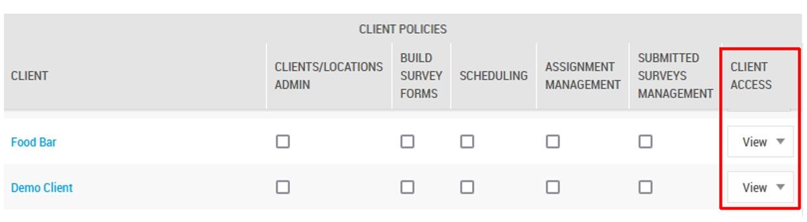
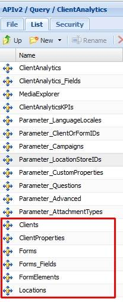

# Granting Access for Shopmetrics API Consumption to End Client Users

Last Modified: 2025-11-05 | Code: APIECU

## Introduction

This article explains how to provide access to the Shopmetrics API for querying Client Access Data to your end clients.

At the end of the article you will find a PDF document attached - *Shopmetrics API: Querying Client Access Data*. This document is a user guide to the Shopmetrics API, designed for technical users within your end client‘s organization.

## User Access Setup and API Credentials

Working with the Shopmetrics API requires a User Account in the Shopmetrics Platform and Client Credentials associated with that account. To set up the User Account and the Client Credentials, you need to do the following:

1. Create a new Client User account in Shopmetrics which must have the following settings:

- Membership in the "**Client User**" security role.
- Membership in the “**Myst.ClientAccess.API**” security group. The membership in this group provides access to the Shopmetrics API functionality.
- Client Access permissions to **View** clients to be able to get the desired Client Access data:

The settings, in combination with one another, will allow your end clients to access data from the following API resources:

Using these resources the users are able to extract details for the following Shopmetrics Entities: Clients, Forms, Locations and Custom Properties. Note that some of these details (like Address and Sub Title) are fields that Client Users normally cannot access within the Shopmetrics application.

2. Create Client Credentials for the new client user account. You can manage the Client Credentials in Shopmetrics via the **Shopmetrics API v2 Authorization — Client Credentials** interface, located in Administration -> Tools and Settings -> Site Settings -> Other. More information about creating Client Credentials can be found in the Shopmetrics Knowledgebase article “API Authorization” (search code **APIAUT**), section “Create Client Credentials”.

## Shopmetrics API: Querying Client Access Data

**NOTE: This document will expire on 2026-07-07. For most recent version of the document, please refer to your Shopmetrics contact.**

To download the document please click on the link:

[Shopmetrics Client Access API v2.01 Reference Guide](https://www.shopmetrics.com/getattachment.asp?ID=18265173&AccessToken=29EEF2D15CAD4DE4AC2402EEE619524E0EF7A669FEDF434AA7B6C6459E5E9784)
